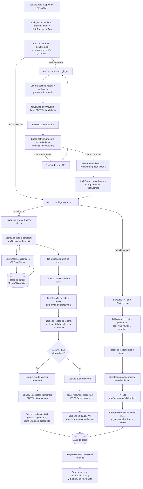

# Documentación Técnica — LibraryHub

> **⚠️ Documento histórico (julio 2026).** Las secciones 1 a 4 de este
> archivo describen la **arquitectura anterior** de LibraryHub, basada en
> un backend Express que escuchaba en un puerto HTTP, con autenticación
> por JWT y dos backends intercambiables (`server/` y `server-mock/`) que
> el frontend elegía con la variable de entorno `VITE_API_URL`.
>
> Esa arquitectura fue reemplazada. El proyecto ahora corre como una
> **aplicación de escritorio con Electron**: el proceso principal de
> Electron se conecta a MongoDB directamente, expone la lógica de
> negocio a través de **canales IPC**, y el frontend React se comunica
> con él mediante `window.libraryHub` (expuesto por el preload). No hay
> servidor HTTP, no hay JWT, no hay `server-mock/`.
>
> El detalle de la arquitectura actual está en el **Anexo al final de
> este documento** y en el archivo `PLAN_MIGRACION_ELECTRON_IPC.md`. El
> `README.md` también fue actualizado para reflejar el nuevo flujo de
> instalación y ejecución. Este archivo se conserva porque describe el
> razonamiento de las secciones internas (modelos, lógica de negocio,
> recorrido de cada acción) que en su mayoría siguen siendo válidas
> —solo cambió **cómo** el frontend invoca esa lógica, no **qué** hace.

## Introducción

Este documento reúne, en un solo lugar, la documentación completa del
funcionamiento interno de LibraryHub: su arquitectura general, el recorrido
paso a paso de cada acción principal del usuario, la estructura completa del
proyecto archivo por archivo, y el funcionamiento detallado del backend y su
comunicación con el frontend. Está pensado como una guía de estudio para
cualquiera que necesite entender el sistema sin depender de explicaciones
externas ni de tener que leer todo el código fuente de punta a punta.

---

## Índice

1. [Arquitectura general y flujo principal](#1-arquitectura-general-y-flujo-principal)
   - [Diagrama de flujo (Mermaid)](#diagrama-de-flujo)
   - [Explicación de cada bloque](#cómo-se-explica-cada-bloque-en-palabras-simples)
2. [Recorrido paso a paso de cada acción del usuario](#2-recorrido-paso-a-paso-de-cada-acción-del-usuario)
   - [Inicio de sesión](#1️⃣-inicio-de-sesión)
   - [Buscar libros](#2️⃣-buscar-libros)
   - [Ver el detalle de un libro](#3️⃣-ver-el-detalle-de-un-libro)
   - [Solicitar un préstamo](#4️⃣-solicitar-un-préstamo)
   - [Hacer una reserva](#5️⃣-hacer-una-reserva)
   - [Renovar un préstamo](#6️⃣-renovar-un-préstamo)
   - [Ver multas](#7️⃣-ver-multas)
   - [Registrar una devolución](#8️⃣-registrar-una-devolución-panel-del-bibliotecario)
3. [Estructura del proyecto](#3-estructura-del-proyecto)
   - [Frontend (`src/`)](#frontend-src)
   - [Backend principal (`server/`)](#backend-principal-server)
   - [Backend alternativo (`server-mock/`)](#backend-alternativo-server-mock)
   - [Mapa jerárquico y corazón del proyecto](#mapa-jerárquico-del-proyecto-solo-lo-esencial)
4. [El backend en profundidad y diagrama general](#4-el-backend-en-profundidad-y-diagrama-general)
   - [Cómo viaja una petición, de punta a punta](#cómo-viaja-una-petición-de-punta-a-punta)
   - [Cómo `server-mock` reemplaza a `server`](#cómo-server-mock-reemplaza-a-server-sin-que-el-frontend-se-entere)
   - [Diagrama general del sistema completo](#diagrama-general-del-sistema-completo)
   - [Resumen del funcionamiento de LibraryHub](#resumen-del-funcionamiento-de-libraryhub)
   - [Mapa mental del proyecto](#mapa-mental-del-proyecto)

---

# 1. Arquitectura general y flujo principal

## El recorrido, en una frase

Cuando abres LibraryHub, React dibuja la pantalla de login. Cuando inicias sesión, el navegador guarda un "carnet digital" (el token JWT) y React empieza a mostrarte páginas protegidas, que piden datos al backend cada vez que las necesitan, y el backend los busca en la base de datos y te los devuelve en formato JSON.

## Diagrama de flujo



## Cómo se explica cada bloque, en palabras simples

### 1. `main.jsx` — el arranque de todo

Es el primer archivo que se ejecuta. Su único trabajo es decirle a React "dibújate aquí, dentro de esta página HTML" y envolver toda la aplicación con dos cosas importantes:

- **`BrowserRouter`**: le da a React la capacidad de cambiar de "página" (en realidad son componentes distintos) sin recargar el navegador. Es lo que permite que la URL cambie de `/libros` a `/mi-perfil` sin que la página parpadee.
- **`AuthProvider`**: es como una mochila que va colgada por encima de toda la app, y que guarda quién está logueado ahora mismo. Cualquier componente de adentro puede mirar dentro de esa mochila.

### 2. `App.jsx` — el mapa de rutas

Piensa en este archivo como un guardia de seguridad con un mapa del edificio. Decide qué "sala" (componente) se muestra según dos cosas: la URL que pediste y si tienes una sesión iniciada.

- Si no hay nadie logueado, solo te deja entrar al Login.
- Si ya iniciaste sesión, no te deja volver a ver el Login: te manda directo a tu sala correspondiente (`/libros` si eres miembro, `/bibliotecario` si eres bibliotecario).
- Hay un componente llamado `RequireAuth` que actúa de "cadena" en la puerta: si detecta que no hay usuario, te devuelve al login. Si detecta que tu rol no tiene permiso para esa sala (por ejemplo, un miembro tratando de entrar al panel de bibliotecario), te redirige a `/libros`.

### 3. `AuthContext.jsx` — la memoria de la sesión

Este archivo resuelve un problema típico: React, por sí solo, "olvida todo" cada vez que refrescas la página. Si no hiciéramos nada, cada F5 te sacaría de la sesión.

La solución es simple: cuando inicias sesión, se guardan dos cosas en el `localStorage` del navegador (una cajita que persiste aunque cierres la pestaña):

- Los datos del usuario (nombre, rol, etc.)
- El token JWT (una cadena de texto larga que funciona como un "carnet firmado" que demuestra que eres tú)

Cada vez que la app se vuelve a abrir, `AuthContext` mira esa cajita antes de dibujar nada. Si encuentra algo, restaura la sesión sin que tengas que volver a escribir tu contraseña.

### 4. `apiService.js` — el único que le habla al backend

Ninguna página de React hace un `fetch` por su cuenta. Todas pasan por este archivo, que centraliza dos cosas:

- Sabe la dirección del backend (`VITE_API_URL`).
- Agrega automáticamente el token JWT guardado en el paso anterior a cada petición, en un encabezado llamado `Authorization`.

Esto es útil porque si mañana cambia la forma de autenticarse, solo hay que tocar este archivo, no cada página una por una.

### 5. El backend (`server/` o `server-mock/`) — quien de verdad guarda los datos

El backend es un programa aparte (corre en otro proceso, en otro puerto) escrito en Express. Su trabajo es recibir peticiones HTTP, revisar el token, hablar con la base de datos y devolver una respuesta en formato JSON.

Está organizado en **routers**: un archivo por cada "tema" (libros, préstamos, reservas, multas, etc.). Cada router agrupa los endpoints relacionados, para no tener un archivo gigante con todo mezclado.

Antes de ejecutar la lógica de cada endpoint protegido, pasa por un **middleware** llamado `verifyToken`: es un filtro que revisa el token JWT antes de dejar pasar la petición. Si el token no existe o es inválido, corta la petición ahí mismo con un error 401, y el código del endpoint ni siquiera se llega a ejecutar.

### 6. La base de datos — MongoDB o `db.json`

Es donde realmente "viven" los libros, miembros, préstamos, etc. El proyecto puede usar dos opciones intercambiables:

- **MongoDB real**, a través de Mongoose (una librería que traduce entre JavaScript y consultas de MongoDB).
- **Un archivo `db.json`** en disco, para poder probar todo sin instalar una base de datos de verdad.

El frontend nunca sabe ni le importa cuál de las dos está detrás: para él, ambas responden exactamente igual.

### 7. El "toast" (notificación) — cómo te enteras de que algo pasó

Cuando pides un préstamo o haces una reserva, el backend responde con un mensaje de texto (por ejemplo, "Préstamo registrado con éxito"). Ese mensaje se muestra en una pequeña notificación temporal en la esquina de la pantalla —el "toast"— para que sepas si tu acción funcionó o no, sin necesidad de recargar nada.

---

# 2. Recorrido paso a paso de cada acción del usuario

## 1️⃣ Inicio de sesión

1. **Acción del usuario:** escribe su cédula y contraseña en el formulario de login y hace clic en "Ingresar" (o en una credencial de demo, que solo rellena los campos por él).
2. **Componente involucrado:** `Login.jsx`.
3. **Función ejecutada:** `handleSubmit`, disparada por el evento `onSubmit` del formulario.
4. **Llamada al `apiService`:** `loginUsuario(cedula, password)`.
5. **Endpoint del backend:** `POST /api/auth/login`.
6. **Lógica del backend:** el router de auth busca al miembro por su cédula, compara la contraseña recibida contra el hash guardado (nunca se guarda la contraseña en texto plano), verifica que la cuenta esté activa, y si todo está bien arma un token JWT firmado con `JWT_SECRET` que expira en 7 días.
7. **Base de datos:** se consulta el modelo `Miembro`, buscando por el campo `cedula`.
8. **Respuesta enviada al frontend:** un JSON con `{ ok: true, token, user }`, donde `user` trae todos los datos del miembro **excepto** la contraseña. Si las credenciales fallan, responde un error 401 con un mensaje explicativo, y `apiService` lo transforma en `null` para el componente.
9. **Actualización de la interfaz:** si la respuesta es válida, `Login.jsx` llama a `login(user, token)` de `AuthContext`, que guarda ambos datos en `localStorage`. Inmediatamente después, `navigate()` redirige a `/libros` o `/bibliotecario` según el rol. Si la respuesta fue `null`, se muestra un mensaje de error debajo del formulario, sin recargar la página.

> 💡 **Buena práctica:** la contraseña nunca viaja de vuelta en la respuesta, y nunca se guarda tal cual en la base de datos (se guarda un *hash*, una especie de huella digital irreversible). Así, ni siquiera alguien con acceso a la base de datos puede leer la contraseña real de un miembro.

---

## 2️⃣ Buscar libros

1. **Acción del usuario:** escribe un término de búsqueda o elige una categoría en la vista de catálogo.
2. **Componente involucrado:** `Libros.jsx`.
3. **Función ejecutada:** un `useEffect` que se dispara cada vez que cambian `busqueda` o `categoriaId`. Antes de llamar a la API, espera 300 milisegundos usando `setTimeout`.
4. **Llamada al `apiService`:** `getLibros({ busqueda, categoria_id })`.
5. **Endpoint del backend:** `GET /api/libros?busqueda=...&categoria_id=...`.
6. **Lógica del backend:** arma un filtro de búsqueda por título, autor o ISBN (sin distinguir mayúsculas/minúsculas), y opcionalmente por categoría. Antes de usar el texto escrito por el usuario, lo "limpia" con una función que neutraliza caracteres especiales.
7. **Base de datos:** se consulta el modelo `Libro`, uniendo (`populate`) el nombre real de la categoría, y ordenando alfabéticamente por título.
8. **Respuesta enviada al frontend:** un arreglo JSON con todos los libros que cumplen el filtro, ya en el formato que la interfaz espera (categoría como texto plano, no como referencia).
9. **Actualización de la interfaz:** se guarda el resultado en el estado `libros`, y React vuelve a dibujar la grilla de tarjetas automáticamente.

> 💡 **Buena práctica — debounce:** el `setTimeout` de 300ms evita disparar una petición al backend por cada letra que el usuario escribe. Si sigue tecleando antes de que se cumplan los 300ms, el temporizador anterior se cancela (`clearTimeout`) y se reinicia. Esto reduce muchísimo la cantidad de peticiones innecesarias.
>
> 💡 **Buena práctica — seguridad:** el texto de búsqueda se usa dentro de una expresión regular en MongoDB. Si no se "escapara", alguien podría escribir caracteres especiales de regex para hacer que la búsqueda sea extremadamente lenta (un ataque conocido como ReDoS) o se comporte de forma inesperada. El backend neutraliza esto antes de usarlo.

---

## 3️⃣ Ver el detalle de un libro

1. **Acción del usuario:** hace clic sobre una tarjeta del catálogo.
2. **Componente involucrado:** `LibroDetalle.jsx` (la URL cambia a `/libros/:id`, gracias a React Router).
3. **Función ejecutada:** `cargarDatos`, ejecutada dentro de un `useEffect` apenas el componente se monta o cambia el `id` de la URL.
4. **Llamada al `apiService`:** tres llamadas en cadena: `getLibroById(id)`, `getReservasByLibro(id)` y, si el usuario es miembro, `getReservasByMiembro()` (para saber si ya tiene una reserva sobre ese mismo libro).
5. **Endpoint del backend:** `GET /api/libros/:id`, `GET /api/reservas/libro/:libro_id` y `GET /api/reservas/me`.
6. **Lógica del backend:** el primero busca el libro por su id; el segundo arma la cola completa de reservas activas de ese libro (ordenada por posición); el tercero busca las reservas del miembro logueado para poder comparar si alguna coincide con el libro actual.
7. **Base de datos:** se consultan los modelos `Libro` y `Reserva`.
8. **Respuesta enviada al frontend:** tres JSON separados: el libro, la lista de la cola de reservas, y las reservas propias del usuario.
9. **Actualización de la interfaz:** se guardan en tres estados distintos (`libro`, `reservas`, `miReserva`). Con esos datos, el componente decide qué botón mostrar: "Solicitar préstamo" si hay copias disponibles, o "Reservar" si no las hay (y, si el usuario ya está en la cola, muestra su posición en vez del botón).

> 💡 **Nota de diseño:** `cargarDatos` no es solo la carga inicial — también se vuelve a llamar después de pedir un préstamo o una reserva, para que la pantalla siempre refleje el estado más actualizado sin tener que recargar toda la página.

---

## 4️⃣ Solicitar un préstamo

1. **Acción del usuario:** hace clic en "Solicitar préstamo" en la vista de detalle (solo visible si hay copias disponibles).
2. **Componente involucrado:** `LibroDetalle.jsx`.
3. **Función ejecutada:** `handlePrestamo`.
4. **Llamada al `apiService`:** `solicitarPrestamo(libro.id)`.
5. **Endpoint del backend:** `POST /api/prestamos`.
6. **Lógica del backend:** primero pasa por el middleware `verifyToken`, que decodifica el JWT y descubre qué miembro está haciendo la petición (por eso el frontend no necesita enviar el id del miembro: ya está adentro del token). Luego valida que el libro exista y tenga copias disponibles, calcula la fecha de devolución (14 días desde hoy), crea el préstamo y resta una copia disponible al libro.
7. **Base de datos:** se crea un documento en el modelo `Prestamo`, y se actualiza el campo `copias_disponibles` del modelo `Libro` correspondiente.
8. **Respuesta enviada al frontend:** `{ ok: true, mensaje: "Préstamo registrado con éxito.", prestamo: {...} }`, o un error con `ok: false` y un mensaje explicativo (por ejemplo, si ya no quedan copias).
9. **Actualización de la interfaz:** se muestra un *toast* con el mensaje de éxito o error, y si salió bien, se vuelve a llamar a `cargarDatos()` para refrescar la disponibilidad en pantalla al instante.

> 💡 **Buena práctica:** el backend nunca confía en un dato que le mande el frontend para saber "quién" hace la petición — lo obtiene siempre del token verificado. Esto evita que alguien pueda, por ejemplo, pedir un préstamo a nombre de otro miembro simplemente cambiando un número en la petición.

---

## 5️⃣ Hacer una reserva

1. **Acción del usuario:** hace clic en "Reservar" en la vista de detalle (solo visible si no hay copias disponibles).
2. **Componente involucrado:** `LibroDetalle.jsx`.
3. **Función ejecutada:** `handleReserva`.
4. **Llamada al `apiService`:** `hacerReserva(libro.id)`.
5. **Endpoint del backend:** `POST /api/reservas`.
6. **Lógica del backend:** verifica que el miembro no tenga ya una reserva activa para ese mismo libro (para no duplicar), calcula la posición en la cola contando cuántas reservas activas existen para ese libro, y estima una fecha de disponibilidad multiplicando la posición por 14 días (una aproximación simple, no una promesa exacta).
7. **Base de datos:** se crea un documento en el modelo `Reserva`, enlazado al `Libro` y al `Miembro`.
8. **Respuesta enviada al frontend:** `{ ok: true, mensaje: "Reserva creada. Estás en posición X en la cola.", reserva: {...} }`.
9. **Actualización de la interfaz:** *toast* de confirmación y recarga de los datos del libro, para que ahora se muestre la posición en la cola en vez del botón de reservar.

> 💡 **Nota de diseño:** la validación de "no puedes reservar dos veces el mismo libro" se hace en el backend, no solo escondiendo el botón en el frontend. Esto es importante: cualquier validación que solo exista en el frontend puede saltarse fácilmente, así que las reglas de negocio importantes siempre se confirman también del lado del servidor.

---

## 6️⃣ Renovar un préstamo

1. **Acción del usuario:** hace clic en "Renovar" junto a uno de sus préstamos activos, en la vista Mi Perfil.
2. **Componente involucrado:** `MiPerfil.jsx`.
3. **Función ejecutada:** `handleRenovar`.
4. **Llamada al `apiService`:** `renovarPrestamo(prestamoId)`.
5. **Endpoint del backend:** `PATCH /api/prestamos/:id/renovar`.
6. **Lógica del backend:** confirma que el préstamo le pertenezca al usuario logueado (o que quien pide la renovación sea un bibliotecario), revisa que el préstamo no esté ya devuelto, y comprueba el contador de renovaciones: si ya llegó al máximo permitido (2), rechaza la petición con un mensaje claro; si no, suma 14 días a la fecha de devolución esperada y aumenta el contador en uno.
7. **Base de datos:** se actualiza el documento existente en `Prestamo` (campos `fecha_devolucion_esperada` y `renovaciones`), no se crea uno nuevo.
8. **Respuesta enviada al frontend:** un mensaje de éxito indicando cuántas renovaciones lleva (por ejemplo, "1/2"), o un error si ya se alcanzó el límite.
9. **Actualización de la interfaz:** *toast* con el resultado, y recarga de la lista de préstamos. Además, el botón "Renovar" se desactiva solo en la interfaz cuando el préstamo ya llegó al límite, para que el usuario ni siquiera pueda intentarlo de nuevo sin sentido.

> 💡 **Buena práctica — defensa en profundidad:** el límite de renovaciones se aplica en **dos lugares**: se desactiva el botón en React (para una mejor experiencia de uso) y también se verifica en el backend (para que la regla se cumpla de verdad, incluso si alguien intentara saltarse el botón llamando a la API directamente).

---

## 7️⃣ Ver multas

1. **Acción del usuario:** entra a la vista Mi Perfil (las multas se muestran ahí junto a los préstamos, sin una acción explícita adicional).
2. **Componente involucrado:** `MiPerfil.jsx`.
3. **Función ejecutada:** `cargar`, ejecutada por un `useEffect` al montar el componente.
4. **Llamada al `apiService`:** `getPrestamosActivos()` y `getMultasByMiembro()`, **ambas al mismo tiempo** usando `Promise.all`.
5. **Endpoint del backend:** `GET /api/prestamos/me` y `GET /api/multas/me`.
6. **Lógica del backend:** el segundo endpoint busca en el modelo `Multa` todas las que pertenezcan al miembro logueado y todavía no estén pagadas (`pagada: false`).
7. **Base de datos:** se consulta el modelo `Multa`, filtrando por `miembro` y `pagada`.
8. **Respuesta enviada al frontend:** un arreglo JSON con las multas pendientes, cada una con su monto en pesos chilenos.
9. **Actualización de la interfaz:** se guarda en el estado `multas`, y se muestra el monto de cada una junto con el total acumulado si hay más de una.

> 💡 **Buena práctica — peticiones en paralelo:** en vez de pedir primero los préstamos y, cuando terminan, recién pedir las multas (uno detrás del otro), `Promise.all` las lanza **al mismo tiempo**. Como son dos peticiones independientes que no dependen una de la otra, hacerlas en paralelo hace que la pantalla cargue más rápido.

---

## 8️⃣ Registrar una devolución (panel del bibliotecario)

1. **Acción del usuario:** el bibliotecario hace clic en "Registrar devolución" junto a un préstamo, dentro del panel administrativo.
2. **Componente involucrado:** `Bibliotecario.jsx`.
3. **Función ejecutada:** `handleDevolucion`.
4. **Llamada al `apiService`:** `registrarDevolucion(prestamoId)`.
5. **Endpoint del backend:** `PATCH /api/prestamos/:id/devolver`.
6. **Lógica del backend:** este endpoint está protegido no solo por `verifyToken` sino también por `requireRole('bibliotecario')` — un miembro común no puede acceder a él aunque conozca la URL. Marca el préstamo como `devuelto`, guarda la fecha real de devolución, le devuelve una copia disponible al libro, y compara la fecha de devolución contra la fecha esperada: si se devolvió tarde, calcula los días de atraso y genera automáticamente una multa de $1.000 CLP por cada día.
7. **Base de datos:** se actualiza el `Prestamo` (estado y fecha), se actualiza el `Libro` (suma una copia disponible) y, si corresponde, se crea un nuevo documento en `Multa`.
8. **Respuesta enviada al frontend:** `{ ok: true, mensaje: "Devolución registrada correctamente." }`.
9. **Actualización de la interfaz:** *toast* de confirmación y se vuelve a llamar a `cargar()`, que trae de nuevo los cuatro listados (préstamos, reservas, multas, miembros) para que el panel completo quede al día, incluyendo la nueva multa si se generó una.

> 💡 **Buena práctica — protección por rol, no solo por interfaz:** que el botón de "Registrar devolución" solo aparezca en el panel del bibliotecario no sería suficiente por sí solo. Por eso el backend vuelve a comprobar el rol del usuario antes de ejecutar la acción — la seguridad real vive en el servidor, la interfaz solo la hace más cómoda de usar.

---

# 3. Estructura del proyecto

## Frontend (`src/`)

### `main.jsx`

- **Responsabilidad:** es el archivo que arranca toda la aplicación. Le dice a React dónde dibujarse dentro del HTML y envuelve todo con `BrowserRouter` (navegación) y `AuthProvider` (sesión).
- **Cuándo se ejecuta:** una sola vez, apenas se carga la página en el navegador.
- **Quién depende de él:** nadie lo importa — es el punto de partida, no una pieza que otros reutilizan.
- **De qué depende:** de `App.jsx`, `AuthContext.jsx` e `index.css`.
- **Si dejara de existir:** la aplicación no arrancaría en absoluto — sería una página en blanco, porque no habría nada que le dijera a React dónde ni cómo dibujarse.
- **Por qué está diseñado así:** separar el "arranque" (`main.jsx`) de la "lógica de rutas" (`App.jsx`) es una convención estándar de Vite/React: mantiene el archivo de entrada mínimo y fácil de leer, sin mezclar configuración de infraestructura con lógica de negocio.

### `App.jsx`

- **Responsabilidad:** define qué componente se muestra según la URL actual, y protege las rutas que requieren sesión o un rol específico.
- **Cuándo se ejecuta:** se vuelve a evaluar cada vez que cambia la URL o el estado de sesión (por ejemplo, después de iniciar o cerrar sesión).
- **Quién depende de él:** `main.jsx` lo monta como componente raíz.
- **De qué depende:** de `AuthContext` (para saber quién está logueado), de `Layout.jsx` (envuelve las rutas internas) y de todas las páginas (`Login`, `Libros`, `LibroDetalle`, `MiPerfil`, `MisReservas`, `Bibliotecario`).
- **Si dejara de existir:** no habría ninguna forma de navegar entre pantallas — solo se podría ver un componente fijo, y no existiría ninguna protección de rutas por rol.
- **Por qué está diseñado así:** el componente `RequireAuth` centraliza la lógica de "¿puede este usuario ver esto?" en un solo lugar, en vez de repetir el mismo `if (!user) return <Navigate ... />` dentro de cada página. Esto evita duplicar la misma validación de seguridad ocho veces.

### `context/AuthContext.jsx`

- **Responsabilidad:** guarda en memoria quién está logueado y expone dos funciones (`login`, `logout`) para modificar esa sesión, sincronizándola siempre con `localStorage`.
- **Cuándo entra en funcionamiento:** se inicializa una vez al arrancar la app (lee `localStorage`), y se actualiza cada vez que alguien llama a `login()` o `logout()`.
- **Quién depende de él:** `App.jsx` (para decidir rutas), `Layout.jsx` (para mostrar el nombre del usuario y el botón de salir), `Login.jsx` (para guardar la sesión), y `LibroDetalle.jsx` (para saber si el usuario logueado es miembro o bibliotecario).
- **De qué depende:** de nada dentro del proyecto — solo usa herramientas nativas de React (`createContext`, `useState`) y del navegador (`localStorage`).
- **Si dejara de existir:** cada página tendría que leer y escribir `localStorage` por su cuenta, duplicando lógica y arriesgando inconsistencias (por ejemplo, que una pantalla piense que hay sesión y otra no).
- **Por qué está diseñado así:** usar el patrón *Context* de React es la forma estándar de compartir un mismo dato (la sesión) entre componentes que no tienen relación directa de padre-hijo, sin tener que pasarlo manualmente de componente en componente ("prop drilling").

### `components/layout/Layout.jsx`

- **Responsabilidad:** dibuja el sidebar de navegación (con el menú según el rol), la cabecera con el nombre del usuario, y el botón de cerrar sesión. El contenido de cada página se inserta dentro mediante `<Outlet />`, la "ranura" que deja React Router para las rutas hijas.
- **Cuándo se ejecuta:** se monta una sola vez apenas el usuario entra a cualquier ruta protegida, y permanece montado mientras navega entre ellas (solo cambia lo que hay dentro del `<Outlet />`).
- **Quién depende de él:** `App.jsx`, que lo usa para envolver todas las rutas internas.
- **De qué depende:** de `AuthContext` (para el nombre del usuario y el logout).
- **Si dejara de existir:** cada página tendría que dibujar su propio menú de navegación por separado, duplicando código y arriesgando que quedaran inconsistentes entre sí.
- **Por qué está diseñado así:** es el patrón clásico de "layout compartido": el sidebar no necesita volver a dibujarse cada vez que cambias de página, solo el contenido central cambia — más eficiente y visualmente más estable (no hay parpadeo del menú).

### `data/apiService.js`

- **Responsabilidad:** es el único archivo de todo el frontend que hace peticiones `fetch` al backend. Centraliza la URL base, agrega el token JWT automáticamente, y expone una función por cada acción posible (`getLibros`, `solicitarPrestamo`, `renovarPrestamo`, etc.).
- **Cuándo entra en funcionamiento:** cada vez que una página necesita datos del servidor o quiere ejecutar una acción (préstamo, reserva, login, etc.).
- **Quién depende de él:** prácticamente todas las páginas (`Login`, `Libros`, `LibroDetalle`, `MiPerfil`, `MisReservas`, `Bibliotecario`).
- **De qué depende:** de la variable de entorno `VITE_API_URL` y de `localStorage` (para leer el token).
- **Si dejara de existir:** ninguna página podría traer ni enviar datos reales — todo el frontend quedaría "mudo", sin poder hablar con el backend.
- **Por qué está diseñado así:** concentrar todos los `fetch` en un solo archivo significa que, si mañana cambia la forma de autenticarse o la URL del backend, solo hay que tocar este archivo una vez, en vez de buscar y modificar cada página que hace una petición.

### `data/utils.js`

- **Responsabilidad:** funciones puras de formateo y cálculo que no dependen del backend: formatear fechas y montos en pesos chilenos, y calcular el estado visual de un préstamo (`vencido`, `alerta`, `activo`) a partir de su fecha de vencimiento.
- **Cuándo se ejecuta:** cada vez que una página necesita mostrar una fecha, un monto o un estado — no hace ninguna petición de red.
- **Quién depende de él:** `MiPerfil.jsx`, `Bibliotecario.jsx`, y `apiService.js` (que reexporta `getEstadoPrestamo` desde aquí).
- **De qué depende:** de nada — son funciones autocontenidas de JavaScript puro.
- **Si dejara de existir:** cada página tendría que reimplementar su propia lógica de formateo de fechas y cálculo de vencimiento, con el riesgo real de que dos pantallas calculen el mismo dato de forma distinta (por ejemplo, un umbral de alerta diferente en cada una).
- **Por qué está diseñado así:** separar "lógica pura" (sin efectos secundarios, sin fetch) de "lógica de red" facilita mucho probar y confiar en estas funciones: dado el mismo préstamo, siempre van a devolver el mismo resultado, sin sorpresas.

### `hooks/useToast.js`

- **Responsabilidad:** maneja el estado de las notificaciones emergentes (toasts): cuándo se muestran, con qué mensaje, y cuándo desaparecen solas (a los 3.5 segundos).
- **Cuándo entra en funcionamiento:** cuando una página llama a `showToast(mensaje, tipo)` después de una acción (login, préstamo, reserva, renovación, devolución).
- **Quién depende de él:** todas las páginas que ejecutan acciones que necesitan confirmación visual.
- **De qué depende:** solo de React (`useState`, `useCallback`).
- **Si dejara de existir:** las páginas no tendrían forma de avisar al usuario si una acción salió bien o mal, salvo mirando la consola del navegador — una pésima experiencia de uso.
- **Por qué está diseñado así:** empaquetar esta lógica repetitiva en un *hook* personalizado evita reescribir el mismo `useState` + `setTimeout` en cada página que necesita mostrar notificaciones.

### `components/ui/` (`Badge.jsx`, `Spinner.jsx`, `Toast.jsx`, `EmptyState.jsx`)

- **Responsabilidad:** piezas visuales pequeñas y genéricas, sin lógica de negocio: una etiqueta de color (`Badge`), un ícono de carga (`Spinner`), la notificación emergente en sí (`Toast`), y un mensaje de "no hay nada que mostrar" (`EmptyState`).
- **Cuándo se ejecutan:** cada vez que una página los usa dentro de su JSX.
- **Quién depende de ellos:** casi todas las páginas.
- **De qué dependen:** de nada más que de sus propias props.
- **Si dejaran de existir:** cada página tendría que reinventar su propio botón de estado o su propio ícono de carga, con estilos inconsistentes entre sí.
- **Por qué están diseñados así:** son "componentes tontos" (no saben nada del backend ni del negocio) a propósito — reciben datos por props y solo se preocupan de mostrarlos bien. Esto los hace reutilizables en cualquier contexto.

### `index.css`

- **Responsabilidad:** importa las utilidades de Tailwind CSS y define clases reutilizables (`.btn-primary`, `.card`, etc.) para no repetir las mismas combinaciones de clases de Tailwind en cada componente.
- **Cuándo se ejecuta:** se carga una sola vez al iniciar la aplicación, y sus clases están disponibles en todo el proyecto.
- **Quién depende de él:** todas las páginas y componentes que usan clases como `btn-primary` o `card`.
- **De qué depende:** de la configuración de Tailwind (`tailwind.config.js`).
- **Si dejara de existir:** la aplicación perdería todos sus estilos visuales — funcionaría igual, pero se vería sin ningún diseño.
- **Por qué está diseñado así:** definir clases compuestas reutilizables evita escribir la misma cadena larga de utilidades de Tailwind una y otra vez en cada botón del proyecto.

### Páginas (`pages/`)

Cada carpeta dentro de `pages/` representa una vista completa, con su propio estado y su propia lógica de carga de datos: `Login`, `Libros`, `LibroDetalle`, `MiPerfil`, `MisReservas` y `Bibliotecario`. El funcionamiento interno de cada una está detallado en la sección 2 — aquí valen como la "unidad" en la que se organiza el frontend: una carpeta por pantalla, con todo lo que esa pantalla necesita adentro.

---

## Backend principal (`server/`)

### `index.js`

- **Responsabilidad:** el punto de arranque del servidor. Configura Express, activa CORS (para permitir que el frontend, que corre en otro puerto, pueda hacerle peticiones), monta cada router en su ruta base (`/api/libros`, `/api/prestamos`, etc.), y por último se conecta a MongoDB antes de abrir el puerto.
- **Cuándo se ejecuta:** una sola vez, cuando se corre `npm run dev` o `npm start` dentro de `server/`.
- **Quién depende de él:** nadie lo importa — es el punto de entrada del proceso del backend.
- **De qué depende:** de `config/db.js` y de los siete archivos dentro de `routes/`.
- **Si dejara de existir:** no habría ningún servidor corriendo — el frontend no tendría con quién hablar, y todas las peticiones fallarían.
- **Por qué está diseñado así:** conectarse a la base de datos **antes** de abrir el puerto HTTP es intencional: así el servidor nunca acepta peticiones que dependen de una base de datos que todavía no está lista, evitando errores confusos al arrancar.

### `config/db.js`

- **Responsabilidad:** establece la conexión a MongoDB usando Mongoose, leyendo la cadena de conexión desde la variable de entorno `MONGODB_URI`.
- **Cuándo se ejecuta:** una sola vez, al arrancar `index.js`.
- **Quién depende de él:** `index.js`, que lo llama antes de abrir el puerto.
- **De qué depende:** de la librería `mongoose` y de la variable `MONGODB_URI`.
- **Si dejara de existir:** ningún modelo (`Libro`, `Miembro`, etc.) podría leer ni escribir datos, porque nunca se establecería la conexión con la base de datos.
- **Por qué está diseñado así:** si la conexión falla, el proceso se corta inmediatamente (`process.exit(1)`) en vez de seguir corriendo "a medias" — es preferible que el servidor no arranque en absoluto a que arranque y falle de forma impredecible en cada petición.

### `models/` (`Libro.js`, `Miembro.js`, `Prestamo.js`, `Reserva.js`, `Multa.js`, `Categoria.js`)

- **Responsabilidad:** cada archivo define la "forma" que debe tener un documento de esa colección en MongoDB (sus campos, tipos y validaciones) usando Mongoose. `Miembro.js`, además, tiene un *hook* que hashea automáticamente la contraseña antes de guardarla, y un método `verificarPassword` para compararla al iniciar sesión.
- **Cuándo entran en funcionamiento:** cada vez que un router hace una operación contra la base de datos (`.find()`, `.create()`, `.findById()`, etc.), pasa a través del modelo correspondiente.
- **Quién depende de ellos:** todos los archivos dentro de `routes/`, y `seed.js`.
- **De qué dependen:** de Mongoose y, en el caso de `Prestamo.js`, `Reserva.js` y `Multa.js`, hacen referencia a `Miembro.js` y `Libro.js` (relaciones entre colecciones).
- **Si dejaran de existir:** Mongoose no sabría qué estructura validar ni cómo interpretar los datos guardados — sería imposible leer o escribir nada de forma confiable.
- **Por qué están diseñados así:** definir un modelo por colección, cada uno en su propio archivo, hace que las reglas de cada entidad (qué campos son obligatorios, qué valores acepta un `estado`, etc.) vivan en un solo lugar, fácil de encontrar y modificar sin tocar la lógica de las rutas.

### `routes/` (siete archivos, uno por recurso)

- **Responsabilidad:** cada archivo agrupa los *endpoints* relacionados a un mismo recurso (autenticación, libros, préstamos, reservas, multas, miembros, categorías). Contienen la lógica de negocio: validar datos, consultar o modificar la base de datos, y devolver la respuesta en JSON.
- **Cuándo entran en funcionamiento:** cada vez que llega una petición HTTP a una ruta que coincide con las que ese router define (por ejemplo, cualquier `/api/prestamos/...` pasa por `prestamos.routes.js`).
- **Quién depende de ellos:** `index.js`, que los monta.
- **De qué dependen:** de sus modelos correspondientes y de `middleware/auth.js` para proteger las rutas que lo necesiten.
- **Si dejaran de existir:** las URLs correspondientes devolverían un 404, y el frontend no podría ni leer ni modificar esos datos.
- **Por qué están diseñados así:** un archivo por recurso (en vez de un único archivo gigante con todos los endpoints) hace que sea mucho más fácil encontrar y modificar la lógica de un módulo puntual sin tener que revisar cientos de líneas ajenas.

### `middleware/auth.js`

- **Responsabilidad:** define dos funciones que actúan como "filtros" antes de que se ejecute la lógica de un endpoint: `verifyToken` (comprueba que el JWT sea válido y expone los datos del usuario en `req.user`) y `requireRole` (comprueba que ese usuario tenga el rol necesario).
- **Cuándo entra en funcionamiento:** en cada petición a una ruta protegida, **antes** de que se ejecute el código propio del endpoint.
- **Quién depende de él:** todos los routers, salvo `auth.routes.js` (el login, obviamente, no puede exigir estar logueado para poder loguearse).
- **De qué depende:** de la librería `jsonwebtoken` y de la variable `JWT_SECRET`.
- **Si dejara de existir:** cualquier persona podría llamar a cualquier endpoint sin haber iniciado sesión, y cualquier miembro podría ejecutar acciones reservadas al bibliotecario — sería un agujero de seguridad total.
- **Por qué está diseñado así:** implementarlo como middleware (una función que se ejecuta "en el camino" antes del endpoint) permite reutilizar la misma verificación en decenas de rutas distintas sin copiar y pegar el mismo bloque de código de validación en cada una.

### `seed.js`

- **Responsabilidad:** llena la base de datos con datos de ejemplo (miembros, libros, categorías, préstamos, reservas, multas) para poder probar el sistema sin tener que cargar todo a mano.
- **Cuándo se ejecuta:** manualmente, corriendo `npm run seed` — nunca se ejecuta solo, ni como parte del arranque normal del servidor.
- **Quién depende de él:** nadie — es una herramienta de desarrollo, no parte del sistema en funcionamiento.
- **De qué depende:** de todos los modelos y de `config/db.js`.
- **Si dejara de existir:** habría que crear manualmente cada miembro y cada libro (por ejemplo, uno por uno desde una consola de Mongo) para poder probar cualquier funcionalidad.
- **Por qué está diseñado así:** tener datos de ejemplo reproducibles con un solo comando hace que cualquiera que clone el proyecto pueda probarlo en minutos, con las mismas credenciales de siempre.

---

## Backend alternativo (`server-mock/`)

- **Propósito general:** ofrecer exactamente el mismo contrato de API que `server/` (mismas rutas, mismo formato de respuesta, mismos tokens), pero sin depender de MongoDB. En vez de una base de datos real, todo se guarda en un archivo `db.json`, usando la librería `json-server` como motor de persistencia simple.

- **`index.js`:** cumple el mismo rol que `server/index.js`, pero en vez de tener routers separados por archivo, define casi todos los endpoints directamente aquí (por simplicidad, al no necesitar Mongoose). Cada operación que en `server/` sería un `Prestamo.create()` o un `Libro.findByIdAndUpdate()`, aquí es simplemente modificar un arreglo en memoria y después escribirlo en disco.
- **`db.json`:** la "base de datos" en sí — un archivo de texto plano en formato JSON que contiene todos los libros, miembros, préstamos, reservas y multas. Cada operación de escritura reescribe este archivo completo.
- **`db.seed.json`:** una copia de respaldo de los datos iniciales, para poder restaurar `db.json` a su estado original cuando se necesite (por ejemplo, después de hacer pruebas que ensucian los datos).
- **`reset.js`:** un script que copia `db.seed.json` sobre `db.json`, devolviendo todo a su estado inicial.
- **`middleware/auth.js` y `utils/format.js`:** cumplen exactamente el mismo rol que sus equivalentes en `server/` — de hecho, están escritos de forma casi idéntica a propósito, para que ambos backends se comporten igual.
- **Si `server-mock/` dejara de existir:** el proyecto seguiría funcionando perfectamente con `server/`, siempre que hubiera una instancia de MongoDB disponible — se perdería únicamente la posibilidad de probar el sistema sin instalar una base de datos.
- **Por qué está diseñado así:** mantener dos implementaciones que cumplen el mismo contrato (en vez de una sola) le da al proyecto flexibilidad para desarrollarse o probarse en cualquier máquina, incluso sin MongoDB instalado, sin que el frontend necesite saber cuál de las dos está corriendo.

---

## Mapa jerárquico del proyecto (solo lo esencial)

```
LibraryHub/
├── src/
│   ├── main.jsx                     ⭐ arranque de React
│   ├── App.jsx                      ⭐ rutas y protección por rol
│   ├── index.css                    estilos globales (Tailwind)
│   ├── context/
│   │   └── AuthContext.jsx          ⭐ sesión del usuario (JWT)
│   ├── data/
│   │   ├── apiService.js            ⭐ única puerta de salida hacia el backend
│   │   └── utils.js                 formateo y estado de préstamos
│   ├── hooks/
│   │   └── useToast.js              notificaciones emergentes
│   ├── components/
│   │   ├── layout/Layout.jsx        ⭐ sidebar + navegación
│   │   └── ui/                      Badge, Spinner, Toast, EmptyState
│   └── pages/
│       ├── Login/                   ⭐ inicio de sesión
│       ├── Libros/                  catálogo y búsqueda
│       ├── LibroDetalle/            préstamo y reserva
│       ├── MiPerfil/                préstamos activos, renovación, multas
│       ├── MisReservas/             cola de reservas
│       └── Bibliotecario/           panel administrativo
│
├── server/
│   ├── index.js                     ⭐ arranque del backend + rutas
│   ├── config/db.js                 conexión a MongoDB
│   ├── middleware/auth.js           ⭐ verificación de JWT y roles
│   ├── models/                      ⭐ esquemas de datos (Mongoose)
│   ├── routes/                      ⭐ lógica de cada recurso de la API
│   └── seed.js                      datos de ejemplo
│
└── server-mock/
    ├── index.js                     mismo contrato de API, sin MongoDB
    ├── db.json                      "base de datos" en disco
    └── reset.js                     restaura los datos de ejemplo
```

### El corazón del proyecto

Si tuviera que señalar un único archivo como el "corazón" del sistema, sería **`apiService.js`**: es el punto de encuentro entre absolutamente todo lo que hace el frontend y absolutamente todo lo que expone el backend. Cualquier cambio en cómo se autentican las peticiones, en la URL del servidor, o en el formato de una respuesta, pasa primero por ahí.

Junto a él, los archivos más críticos para entender el funcionamiento completo del sistema son:

- **`AuthContext.jsx`** — sin entender cómo se guarda y viaja la sesión, es difícil entender por qué el backend "sabe quién sos" en cada petición.
- **`App.jsx`** — es el mapa que conecta URLs con pantallas y con permisos.
- **`server/middleware/auth.js`** — es la contraparte del backend a `AuthContext.jsx`: la mitad de la historia de la autenticación vive en el frontend (guardar el token) y la otra mitad vive acá (verificarlo en cada petición).
- **`server/routes/`** en conjunto — es donde vive toda la lógica de negocio real (qué pasa cuando pides un préstamo, cuándo se genera una multa, etc.), el resto del backend es principalmente configuración alrededor de estas rutas.

Entendiendo estos cinco archivos (`apiService.js`, `AuthContext.jsx`, `App.jsx`, `middleware/auth.js` y la carpeta `routes/`), cualquiera puede seguirle el rastro a cualquier funcionalidad del sistema, de punta a punta.

---

# 4. El backend en profundidad y diagrama general

## Cómo viaja una petición, de punta a punta

Ya vimos qué hace cada pieza por separado. Ahora sigamos **una sola petición real**, sin saltos, desde el clic del usuario hasta que la pantalla se actualiza.

### Paso 1 — El clic dispara una función de React

Un botón en pantalla (por ejemplo, "Solicitar préstamo") tiene un `onClick` que llama a una función dentro del componente (`handlePrestamo`). Esa función no sabe nada de URLs, de JSON ni de bases de datos — solo sabe que tiene que llamar a una función de `apiService.js` y esperar el resultado.

### Paso 2 — `apiService.js` arma la petición HTTP real

Adentro de `apiService.js`, la función `request()` (un ayudante interno que todas las demás funciones usan por debajo) hace tres cosas antes de mandar nada:

1. Lee el token JWT guardado en `localStorage`.
2. Arma la URL completa, pegando la ruta pedida (`/prestamos`) a la URL base del backend (`VITE_API_URL`).
3. Agrega el token en un encabezado llamado `Authorization`, con el formato `Bearer <token>`.

Recién ahí ejecuta el `fetch()` de verdad. Esto es clave: **ninguna página escribe URLs a mano ni maneja el token por su cuenta** — todas confían en que `apiService.js` lo hace siempre igual, sin errores de tipeo ni olvidos.

### Paso 3 — La petición sale del navegador y llega a Express

El navegador manda la petición HTTP al backend, que está corriendo como un proceso completamente aparte (otro programa, en otro puerto). Express, el framework que usa el backend, recibe la petición y la compara contra la lista de rutas que tiene registradas en `index.js` (`/api/prestamos`, `/api/libros`, etc.) para decidir qué router debe atenderla.

### Paso 4 — El middleware actúa como filtro de entrada

Antes de que se ejecute la lógica del endpoint, la petición pasa por `verifyToken`. Piensa en esto como un guardia en la puerta de una oficina: revisa el "carnet" (el token JWT) que viene en el encabezado `Authorization`. Si el carnet es válido, lo decodifica y anota quién es esa persona en `req.user` — así, más adelante, el endpoint no tiene que volver a preguntar "¿quién sos?", ya lo sabe. Si el carnet no existe o está vencido/adulterado, el guardia corta el paso ahí mismo con un error 401, y el código del endpoint **ni siquiera llega a ejecutarse**.

Si el endpoint es exclusivo del bibliotecario (como registrar una devolución), hay un segundo guardia después: `requireRole('bibliotecario')`, que revisa el rol guardado en `req.user` y corta el paso con un error 403 si no coincide.

### Paso 5 — El router ejecuta la lógica de negocio

Recién aquí se ejecuta el código específico del endpoint (dentro de, por ejemplo, `prestamos.routes.js`). Este código hace las validaciones propias de esa acción (¿hay copias disponibles?, ¿ya se alcanzó el límite de renovaciones?, etc.) usando datos normales de JavaScript — todavía no ha tocado la base de datos.

### Paso 6 — El modelo de Mongoose traduce JavaScript a MongoDB

Cuando el router necesita leer o guardar algo, llama a un modelo (por ejemplo, `Prestamo.create({...})` o `Libro.findById(id)`). El modelo es quien realmente sabe cómo convertir esa instrucción de JavaScript en una consulta que MongoDB entiende, y cómo convertir la respuesta de MongoDB de vuelta a un objeto de JavaScript normal. El router nunca escribe una consulta de base de datos "a mano" — siempre pasa por el modelo.

### Paso 7 — MongoDB guarda o entrega el dato

MongoDB (corriendo como su propio proceso, en su propia máquina o contenedor) ejecuta la operación real: agrega un documento nuevo, actualiza uno existente, o busca y devuelve los que coincidan con el filtro. Este es el único lugar del sistema donde los datos realmente "viven" de forma permanente — todo lo anterior (React, Express, los modelos) son solo capas que preparan y transportan esos datos.

### Paso 8 — La respuesta hace el camino de vuelta

MongoDB responde al modelo → el modelo se lo entrega al router → el router arma un objeto JSON simple (`{ ok: true, mensaje: "...", prestamo: {...} }`) → Express lo manda de vuelta como respuesta HTTP → `apiService.js` lo recibe, revisa si el código de estado es de error o de éxito, y se lo entrega tal cual al componente de React que lo pidió.

### Paso 9 — React actualiza la pantalla

El componente guarda ese resultado en su estado (`useState`) y muestra el mensaje mediante un *toast*. React detecta que el estado cambió y vuelve a dibujar automáticamente solo las partes de la pantalla que dependen de ese dato — no hace falta recargar la página en ningún momento.

---

## Cómo `server-mock` reemplaza a `server` sin que el frontend se entere

Todo lo descrito arriba, del Paso 3 en adelante, ocurre **exactamente igual** si en vez de `server/` está corriendo `server-mock/` — con una sola diferencia interna: en el Paso 6 y el Paso 7, en vez de un modelo de Mongoose hablándole a MongoDB, hay funciones más simples que buscan y modifican objetos dentro de un archivo `db.json`, y lo vuelven a guardar en disco después de cada cambio.

Desde el punto de vista del frontend, no existe ninguna diferencia: mismas rutas, mismos encabezados, mismo formato de respuesta JSON. Lo único que decide cuál de los dos está activo es el valor de `VITE_API_URL` en el archivo `.env` del frontend — cambiar esa variable y reiniciar es lo único que hace falta para "enchufar" un backend distinto, sin tocar ni una línea de `apiService.js` ni de ninguna página.

Esto es posible porque ambos backends respetan el mismo **contrato**: la promesa de que, dado el mismo tipo de petición, van a responder con la misma forma de datos. React nunca sabe (ni necesita saber) qué hay del otro lado — solo confía en ese contrato.

---

## Diagrama general del sistema completo

```
┌────────────────────────────────────────────────────────────────────────────┐
│                          1. EL USUARIO ABRE LA APP                          │
│                     (escribe la URL o recarga el navegador)                 │
└───────────────────────────────────┬──────────────────────────────────────--┘
                                     ▼
┌────────────────────────────────────────────────────────────────────────────┐
│  main.jsx arranca React                                                    │
│  → monta BrowserRouter + AuthProvider + App                                │
└───────────────────────────────────┬──────────────────────────────────────--┘
                                     ▼
┌────────────────────────────────────────────────────────────────────────────┐
│  AuthContext revisa localStorage                                          │
│  ¿Hay un usuario y un token guardados de una sesión anterior?              │
└──────────────────┬───────────────────────────────┬───────────────────────-┘
                    │ NO                            │ SÍ
                    ▼                               ▼
      ┌───────────────────────┐       ┌────────────────────────────────┐
      │   App.jsx muestra      │       │  App.jsx redirige según rol:   │
      │   Login.jsx            │       │  miembro → /libros             │
      │                        │       │  bibliotecario → /bibliotecario│
      └───────────┬────────────┘       └────────────────┬───────────────┘
                  │                                      │
                  ▼                                      │
   ┌───────────────────────────────┐                     │
   │ Usuario ingresa cédula y      │                     │
   │ contraseña, envía el form     │                     │
   └───────────────┬───────────────┘                     │
                   ▼                                     │
   ┌────────────────────────────────────┐                │
   │ apiService.loginUsuario()          │                │
   │ POST /api/auth/login               │                │
   └───────────────┬────────────────────┘                │
                   ▼                                      │
   ┌────────────────────────────────────┐                │
   │ Backend: auth.routes.js            │                │
   │ busca Miembro, verifica password,  │                │
   │ firma un JWT                       │                │
   └───────────────┬────────────────────┘                │
                   ▼                                      │
   ┌────────────────────────────────────┐                │
   │ MongoDB / db.json                  │                │
   │ (lee la colección Miembro)         │                │
   └───────────────┬────────────────────┘                │
                   ▼                                      │
   ┌────────────────────────────────────┐                │
   │ Respuesta { ok, token, user }      │                │
   └───────────────┬────────────────────┘                │
                   ▼                                      │
   ┌────────────────────────────────────┐                │
   │ AuthContext.login() guarda todo    │                │
   │ en localStorage → dispara redirect │                │
   └───────────────┬────────────────────┘                │
                   └──────────────────┬───────────────────┘
                                      ▼
      ┌──────────────────────────────────────────────────────────┐
      │        Layout.jsx dibuja sidebar + menú según el rol       │
      │              (Outlet muestra la página activa)             │
      └───────────────────────────┬────────────────────────────--┘
                                   ▼
      ┌──────────────────────────────────────────────────────────┐
      │  El usuario navega e interactúa: busca libros, ve un      │
      │  detalle, pide un préstamo, hace una reserva, renueva,     │
      │  revisa multas, o (si es bibliotecario) registra una       │
      │  devolución.                                                │
      └───────────────────────────┬────────────────────────────--┘
                                   ▼
      ┌──────────────────────────────────────────────────────────┐
      │  apiService.js arma la petición:                           │
      │  URL + método + header Authorization: Bearer <token>       │
      └───────────────────────────┬────────────────────────────--┘
                                   ▼
      ┌──────────────────────────────────────────────────────────┐
      │  Express recibe la petición y la enruta                    │
      │  (server/index.js  o  server-mock/index.js)                │
      └───────────────────────────┬────────────────────────────--┘
                                   ▼
      ┌──────────────────────────────────────────────────────────┐
      │  Middleware verifyToken                                    │
      │  ¿El token es válido?                                       │
      └──────────────┬───────────────────────────┬───────────────┘
                      │ NO                        │ SÍ
                      ▼                           ▼
       ┌───────────────────────┐    ┌──────────────────────────────┐
       │ Error 401              │    │ Middleware requireRole        │
       │ (si aplica)             │    │ (solo en rutas exclusivas      │
       └───────────┬─────────--┘    │  del bibliotecario)             │
                   │                └──────────────┬────────────────┘
                   │                               ▼
                   │                ┌──────────────────────────────┐
                   │                │  Lógica del router:            │
                   │                │  valida datos, calcula fechas,  │
                   │                │  aplica reglas de negocio       │
                   │                └──────────────┬────────────────┘
                   │                               ▼
                   │                ┌──────────────────────────────┐
                   │                │  Modelo de Mongoose            │
                   │                │  (o funciones equivalentes en   │
                   │                │  server-mock)                    │
                   │                └──────────────┬────────────────┘
                   │                               ▼
                   │                ┌──────────────────────────────┐
                   │                │  MongoDB   ó   db.json          │
                   │                │  lee o escribe el dato real      │
                   │                └──────────────┬────────────────┘
                   │                               ▼
                   │                ┌──────────────────────────────┐
                   │                │  Respuesta JSON                │
                   │                │  { ok, mensaje, datos }          │
                   │                └──────────────┬────────────────┘
                   └───────────────────────────────┤
                                                    ▼
      ┌──────────────────────────────────────────────────────────┐
      │  apiService.js recibe la respuesta y se la entrega          │
      │  tal cual al componente que la pidió                        │
      └───────────────────────────┬────────────────────────────--┘
                                   ▼
      ┌──────────────────────────────────────────────────────────┐
      │  El componente actualiza su estado (useState)               │
      │  showToast() muestra el resultado en pantalla                │
      │  React vuelve a dibujar solo lo que cambió                   │
      └──────────────────────────────────────────────────────────┘
```

---

## Resumen del funcionamiento de LibraryHub

Imagina que **el frontend es un cliente** y **el backend es un mesero de restaurante** que va y viene a la cocina (la base de datos). El cliente nunca entra a la cocina — solo le dice al mesero qué quiere, y espera a que vuelva con el plato o con la noticia de que no hay stock.

**El frontend (React)** es todo lo que ves y con lo que interactúas: los botones, los formularios, las tarjetas de libros. Su único trabajo es mostrar información y capturar lo que el usuario quiere hacer. No guarda nada de forma permanente — si cierras la pestaña sin haber guardado la sesión, todo lo que React tenía en memoria desaparece.

**El backend (Express)** es un programa completamente aparte, que no sabe cómo se ve la pantalla ni le importa. Solo entiende peticiones HTTP: recibe una petición, decide si tiene permiso para hacer lo que pide (usando los *middlewares*), ejecuta la lógica de negocio (calcular una fecha de vencimiento, revisar si hay copias disponibles), y responde con datos en formato JSON, que es básicamente texto estructurado que cualquier lenguaje de programación puede entender.

**MongoDB** es donde los datos de verdad "existen" de forma permanente. Ni React ni Express guardan nada por sí mismos — ambos son intermediarios. Si apagas el servidor de Express y lo prendes de nuevo, los datos siguen ahí, esperando en MongoDB, porque vive en su propio proceso, independiente de todo lo demás.

**¿Por qué existe `apiService.js`?** Porque sin él, cada página tendría que saber la URL del backend, armar el `fetch` a mano, y acordarse de agregar el token en cada petición — con el riesgo real de que alguna página se equivoque o se olvide de algo. Centralizarlo en un solo archivo significa que esa responsabilidad se resuelve **una sola vez**, bien, y todas las páginas simplemente confían en que funciona.

**¿Cuál es el rol de `AuthContext`?** Es la memoria de "quién soy" de toda la aplicación. Sin él, cada componente tendría que leer `localStorage` por su cuenta para saber si hay una sesión activa, con el riesgo de que dos componentes lean cosas distintas o en momentos distintos. `AuthContext` centraliza esa verdad en un solo lugar que toda la app comparte.

**¿Por qué existen los middlewares?** Porque la seguridad no puede depender únicamente de que el frontend "esconda" un botón. Cualquiera con conocimientos básicos podría llamar directamente a una URL del backend sin pasar por la interfaz. Los middlewares (`verifyToken`, `requireRole`) son la verdadera barrera: se ejecutan en el servidor, donde el usuario no los puede saltar, y garantizan que solo quien tiene un token válido —y el rol correcto— puede ejecutar cada acción.

**¿Cómo trabajan todas las piezas juntas?** React captura la intención del usuario → `apiService.js` la convierte en una petición HTTP autenticada → Express la recibe y la filtra con los middlewares → el router aplica las reglas del negocio → el modelo de Mongoose traduce esa operación a una instrucción de MongoDB → MongoDB guarda o entrega el dato real → la respuesta hace el camino inverso hasta llegar de nuevo a React → React actualiza la pantalla. Cada pieza hace **una sola cosa** y confía en que las demás piezas hacen bien la suya — eso es lo que permite que un proyecto con tantas partes se mantenga entendible.

---

## Mapa mental del proyecto

```
                                    LibraryHub
                                        │
                  ┌─────────────────────┼─────────────────────┐
                  │                     │                     │
              FRONTEND               BACKEND             BACKEND ALT.
             (src/, React)        (server/, Express)    (server-mock/)
                  │                     │                     │
     ┌────────────┼────────────┐        │                     │
     │            │            │        │                     │
  context/      data/        hooks/     │                     │
     │            │            │        │                     │
AuthContext   apiService.js  useToast   │              Mismo contrato
(quién soy)   (habla con     (avisos    │              de API que
              el backend)    en pantalla)│              server/, pero
     │            │                     │              guarda todo en
     │            └── utils.js          │              un archivo
     │             (formateo, sin red)   │              db.json en
     │                                   │              vez de Mongo
     │        ┌──────────────────────────┼─────────────────────┐
     │        │                          │                     │
components/  pages/                  config/                routes/
     │        │                    (conexión a           (un archivo
     │   ┌────┼─────┬──────┬───────┐ MongoDB)              por recurso:
     │   │    │     │      │       │      │                auth, libros,
 layout/ Login Libros LibroDetalle │  Bibliotecario         prestamos,
   │           │     │             │       │                reservas,
Layout.jsx  (busca  (préstamo,  MiPerfil MisReservas         multas,
(menú +     libros)  reserva)  (perfil,  (cola de            miembros,
 sidebar)                       multas)   reservas)          categorias)
     │                                                          │
   ui/                                                    middleware/
(Badge,                                                  (verifyToken,
 Spinner,                                                 requireRole:
 Toast,                                                    "¿quién sos,
 EmptyState)                                                y puedes
                                                             hacer esto?")
                                                                 │
                                                             models/
                                                          (Libro, Miembro,
                                                           Prestamo, Reserva,
                                                           Multa, Categoria:
                                                           la forma de los
                                                           datos en Mongo)
                                                                 │
                                                             MongoDB
                                                        (donde todo vive
                                                         de verdad)
```

**Cómo se relacionan entre sí, en una frase por rama:**

- **`context/`** le dice al resto de la app quién está logueado.
- **`data/`** es el puente hacia el backend y las funciones de formateo que no necesitan red.
- **`hooks/`** son herramientas reutilizables de comportamiento (como las notificaciones).
- **`components/`** son piezas visuales que se usan dentro de las páginas.
- **`pages/`** son las pantallas completas, una por cada vista del sistema.
- **`config/`** prepara la conexión a la base de datos antes de que el servidor acepte peticiones.
- **`routes/`** contiene la lógica de negocio de cada recurso de la API.
- **`middleware/`** protege esas rutas antes de que se ejecuten.
- **`models/`** define la forma de los datos y es el único lugar que le habla directamente a MongoDB.
- **`server-mock/`** es un espejo de todo lo anterior, para poder correr el sistema completo sin MongoDB instalado.

---

## Conclusión

Este documento cubre el funcionamiento completo de LibraryHub en cuatro
niveles complementarios: la arquitectura general del sistema, el recorrido
detallado de cada acción que un usuario puede realizar, la responsabilidad
de cada archivo y carpeta del proyecto, y finalmente el viaje técnico
completo de una petición a través del backend. Leídas en conjunto, estas
cuatro secciones permiten entender —sin necesidad de abrir el código— cómo
el frontend, el backend y la base de datos trabajan juntos para que cada
clic del usuario termine convertido en un dato guardado y una pantalla
actualizada.

---

## Anexo — Arquitectura actual (julio 2026): Electron + IPC + services

### Por qué cambió

LibraryHub dejó de ser una aplicación web servida por Express para
convertirse en una aplicación de escritorio. La razón principal: ya no
hacía falta exponer un servidor HTTP ni mantener dos backends
intercambiables. Todo el ciclo de vida del proceso (cargar la UI,
hablar con MongoDB, identificar al usuario) ocurre dentro de un único
proceso de Electron, sin red de por medio.

### Diagrama de la nueva arquitectura

```
┌──────────────────────────────────────────────────────────────┐
│  Renderer (React)                                            │
│  src/pages/*.jsx → src/data/apiService.js → window.libraryHub│
└────────────────────┬─────────────────────────────────────────┘
                     │ ipcRenderer.invoke('canal', args)
                     ▼
┌──────────────────────────────────────────────────────────────┐
│  Preload (electron/preload.cjs)                              │
│  contextBridge.exposeInMainWorld('libraryHub', { ... })      │
└────────────────────┬─────────────────────────────────────────┘
                     │ IPC (mismo proceso)
                     ▼
┌──────────────────────────────────────────────────────────────┐
│  Proceso principal (electron/main.cjs)                       │
│  ipcMain.handle('canal', handler)                            │
│  └─ services/*.js (Mongoose)                                 │
│  └─ sesion.service.js (usuarioActual en memoria)             │
└────────────────────┬─────────────────────────────────────────┘
                     │ Mongoose
                     ▼
                  MongoDB (mongodb://localhost:27017/libraryhub)
```

### Qué hay ahora en `server/`

La carpeta `server/` sigue existiendo pero **ya no es un servidor HTTP**.
Es simplemente el conjunto de archivos que el proceso principal de
Electron carga con `import()` dinámico:

- `server/config/db.js` — `conectarDB()`. Se llama una vez en
  `app.whenReady()` antes de registrar los canales IPC.
- `server/models/` — esquemas de Mongoose (Libro, Miembro, Prestamo,
  Reserva, Multa, Categoria). Sin cambios.
- `server/services/` — **reemplaza a `server/routes/` + `server/middleware/`**.
  Un archivo por recurso, con funciones que reciben sus argumentos
  explícitamente (sin `req`/`res`). Devuelven directamente
  `{ ok, mensaje, ...datos }` en vez de responder con códigos HTTP.
- `server/services/sesion.service.js` — **reemplaza a
  `server/middleware/auth.js`**. Mantiene en memoria quién está logueado
  (`usuarioActual`). `requerirSesion()` lanza un error si no hay nadie;
  `requerirRol('bibliotecario')` lo lanza si el rol no coincide.
- `server/utils/format.js` — `toDate()`. Sin cambios.
- `server/seed.js` — carga datos de ejemplo. Sin cambios.

### Cómo viaja una acción hoy (ejemplo: solicitar un préstamo)

1. El usuario hace clic en "Solicitar préstamo" en `LibroDetalle.jsx`.
2. El componente llama a `solicitarPrestamo(libroId)` exportado por
   `src/data/apiService.js`.
3. `apiService.js` ejecuta `window.libraryHub.solicitarPrestamo(libroId)`.
4. `preload.cjs` lo traduce a `ipcRenderer.invoke('prestamos:solicitar', libroId)`.
5. En `main.cjs`, el handler registrado para `'prestamos:solicitar'`
   resuelve el usuario actual con `getUsuarioActual()` y llama a
   `prestamosService.solicitarPrestamo(libroId, usuarioActual)`.
6. El service valida que haya sesión, busca el libro, descuenta una
   copia, crea el préstamo y devuelve `{ ok: true, mensaje, prestamo }`.
7. `main.cjs` recibe ese objeto (o un error) y, si fue un error, lo
   convierte con `conManejorDeErrores` en `{ ok: false, mensaje }`.
8. `apiService.js` recibe la respuesta y se la devuelve al componente,
   que muestra el toast correspondiente.

### Manejo de errores

El wrapper `conManejorDeErrores` en `main.cjs` envuelve cada handler de
IPC. Si el service lanza cualquier excepción (por ejemplo, un corte de
sesión de `requerirSesion()`, una falta de rol de `requerirRol()`, o
una excepción de Mongoose), el wrapper la captura y devuelve
`{ ok: false, mensaje: error.message }`. Esto significa que el frontend
nunca tiene que envolver llamadas IPC en `try/catch` para que la app no
se caiga — el handler siempre devuelve algo.

### Sesión

La sesión vive en dos lugares sincronizados:

- **Electron (memoria)**: `sesion.service.js` mantiene `usuarioActual`.
  Se setea en `auth.service.js` al validar el login.
- **Renderer (localStorage)**: `AuthContext.jsx` guarda `user` en la
  clave `libraryhub_user` al hacer login, y la restaura al montar el
  provider.

Si la app se reinicia, el `usuarioActual` de Electron empieza en `null`,
pero el `localStorage` del renderer puede tener un usuario guardado.
La regla práctica es: **la sesión se considera activa si el renderer
tiene un `user` en `localStorage`**. Si en el futuro se observa un
desfase entre ambos lados, se puede agregar un canal
`auth:restaurarSesion` para que el `AuthContext` lo invoque al montar y
sincronice el `usuarioActual` de Electron con el `user` del
`localStorage`. En la práctica esto no fue necesario durante el
desarrollo.

### Qué cambió en el frontend

- `src/data/apiService.js` — reescrito por dentro. Las 17 funciones
  exportadas mantienen la misma firma; cada una ahora delega en
  `window.libraryHub.algo(...)`.
- `src/context/AuthContext.jsx` — sin manejo de token. Sigue
  guardando el `user` en `localStorage`.
- `Login.jsx`, `Libros.jsx`, `LibroDetalle.jsx`, `MiPerfil.jsx`,
  `MisReservas.jsx`, `Bibliotecario.jsx`, `App.jsx`, `Layout.jsx` —
  **sin cambios**. La fachada pública de `apiService.js` se
  preservó 1:1, así que ninguna página necesitó tocarse.
- `src/data/utils.js` — sin cambios (funciones puras, no hacen IPC).

### Qué se eliminó

- `server/routes/` (completo) → reemplazado por `server/services/`.
- `server/middleware/auth.js` → reemplazado por
  `server/services/sesion.service.js`.
- `server/index.js`, `server/package.json`, `server/package-lock.json`,
  `server/.env.example`, `server/app.js` (si existió) → ya no hay
  proceso Express que arrancar.
- `server-mock/` (completo) → ya no hay contrato HTTP que igualar.
- Dependencias `express`, `cors`, `jsonwebtoken` del proyecto
  (ahora consolidadas en el `package.json` raíz, junto con `mongoose`,
  `bcryptjs` y `dotenv` que siguen siendo necesarias).
- `example.env` de la raíz (solo contenía `VITE_API_URL`, que ya no
  existe).
- El archivo `docs/Justificacion Tecnica Electron.md` se conserva
  marcado como "decisión anterior revertida", para preservar el
  histórico de la discusión.
